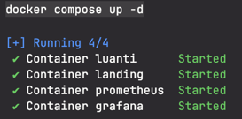
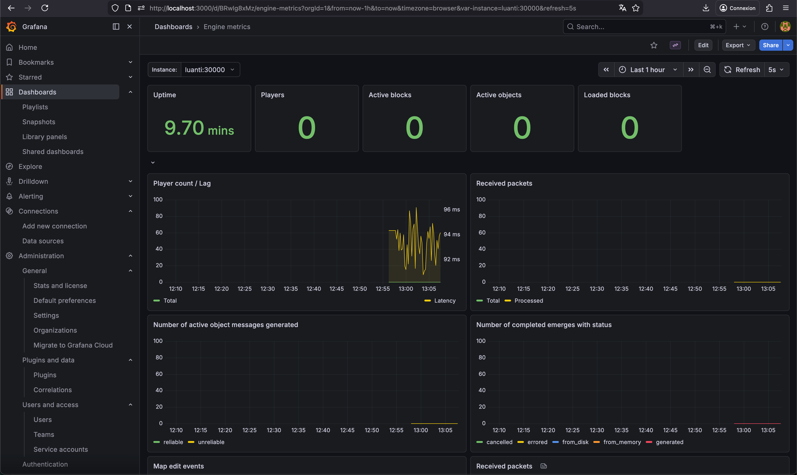
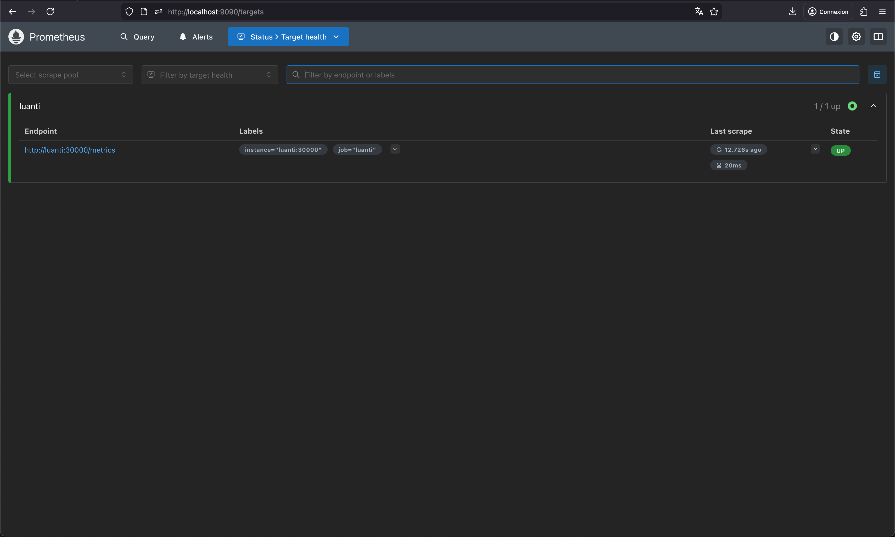

# Luanti Stack - Serveur Luanti avec Monitoring

Infrastructure Docker complète pour serveur de jeu Luanti avec monitoring Prometheus et Grafana.

## Services

| Service | Port | Protocol | Description                                   |
|---------|------|----------|-----------------------------------------------|
| Luanti Server | 30000 | UDP | Serveur de jeu                                |
| Luanti Metrics | 30000 | TCP | Endpoint Prometheus pour scrape les données   |
| Prometheus | 9090 | HTTP | Collecte des métriques (Prometheus dashboard) |
| Grafana | 3000 | HTTP | Visualisation                                 |
| Landing (Nginx) | 8080 | HTTP | Page d'accueil / Landing page                 |

## Démarrage rapide

```bash
# Cloner le repository
git clone <repo-url>
cd luanti-stack

# Construire et lancer tous les services
docker compose up -d --build

# Vérifier le statut des services
docker compose ps
```

## Accès

| Service | URL | Identifiants |
|---------|-----|--------------|
| Landing Page | http://localhost:8080 | - |
| Grafana | http://localhost:3000 | admin / admin |
| Prometheus | http://localhost:9090 | - |

## Connexion au serveur de jeu

1. Ouvrir Luanti (client de jeu)
2. Se rendre dans l'onglet "Join Game"
3. Entrer `localhost` comme adresse serveur
4. Port : `30000`

## Structure du projet

```
luanti-stack/
├── docker-compose.yml      # Orchestration des services
├── Dockerfile              # Image Luanti avec Prometheus
├── minetest/
│   └── minetest.conf       # Configuration serveur
├── prometheus/
│   └── prometheus.yml       # Configuration scrape
├── grafana/
│   ├── dashboards/
│   │   └── luanti-minimal.json
│   └── provisioning/
│       ├── datasources/
│       │   └── datasource.yml
│       └── dashboards/
│           └── dashboards.yml
└── web/
    └── index.html           # Landing page
```

## Configuration détaillée

### Luanti (Dockerfile)

**Pourquoi une compilation ?**

Le support Prometheus doit être activé au moment de la compilation car il active des fonctionnalités C++ dans le binaire. Cela ne peut pas être changé au runtime.

PS : J'ai remarqué en allant regarder [l'image officiel](https://github.com/luanti-org/luanti/blob/master/Dockerfile) que Prometheus était déjà compilé.
J'ai donc utilisé l'image officiel en incluant mon mode de jeu dans le Dockerfile.

`ENABLE_PROMETHEUS` permet d'activé la compilation/linkage de **Luanti** avec **prometheus-cpp**

**Pourquoi une IA est capable d’écrire ce Dockerfile, mais pourquoi vous devez le comprendre**

L'IA écrit le Dockerfile car elle a mémorisé des millions de données, elle a donc été capable de le reconstruire du momenet ou on lui donne un context clair / prompt.

C'est essentiel de comprendre ce que génère l'IA car elle peut inclure tout un tas de choses pas forcément nécéssaire, des failles de sécurités, des façons de faire pas forcéement optimal.

Il faut prendre le temps de regarder, corriger et prendre du recul sur ce qu'elle fournis en ayant toujorus un esprit critque.

### Prometheus

Prometheus scrappe les métriques toutes les 5 secondes via `http://luanti:30000/metrics`.

- `scrape_interval: 5s` : Correspond a la fréquence de collecte
- `luanti:30000` : Le nom est résolu grâce au DNS interne de Docker

## Capture d'écran attendue

### Docker



### Grafana



### Prometheus


